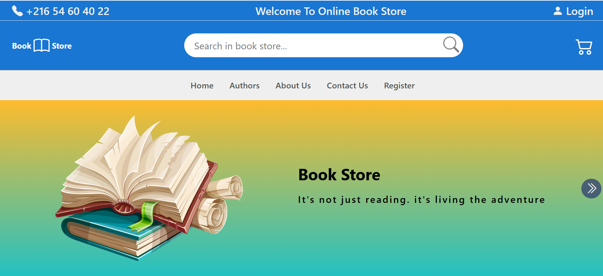
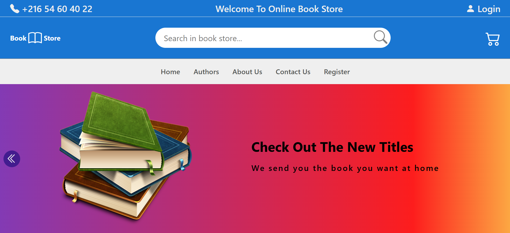
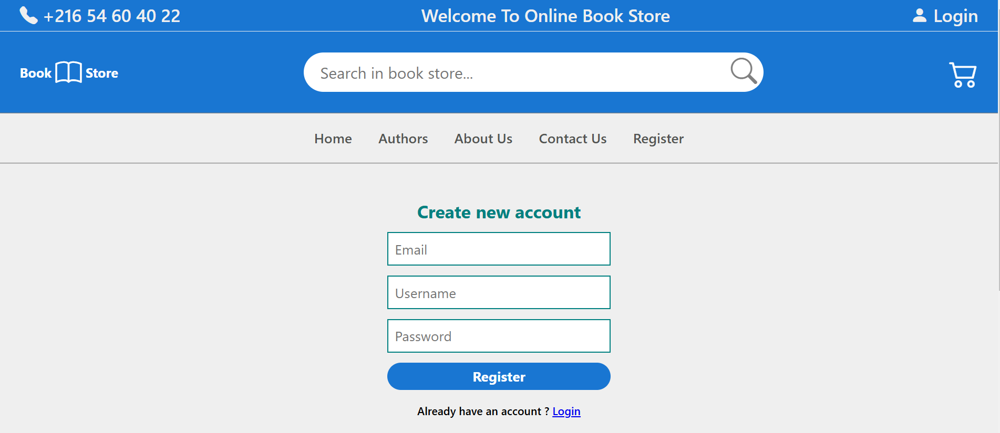
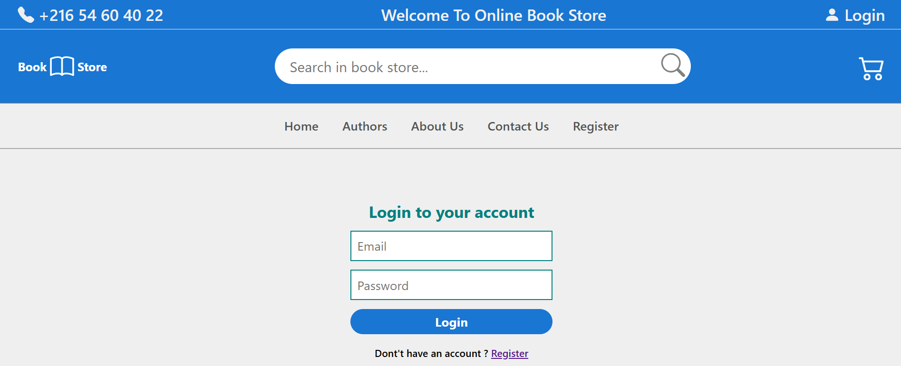
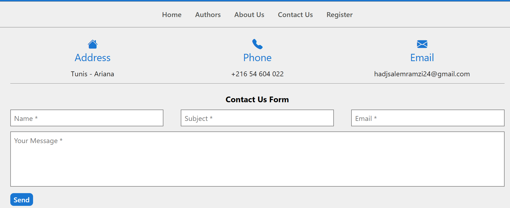
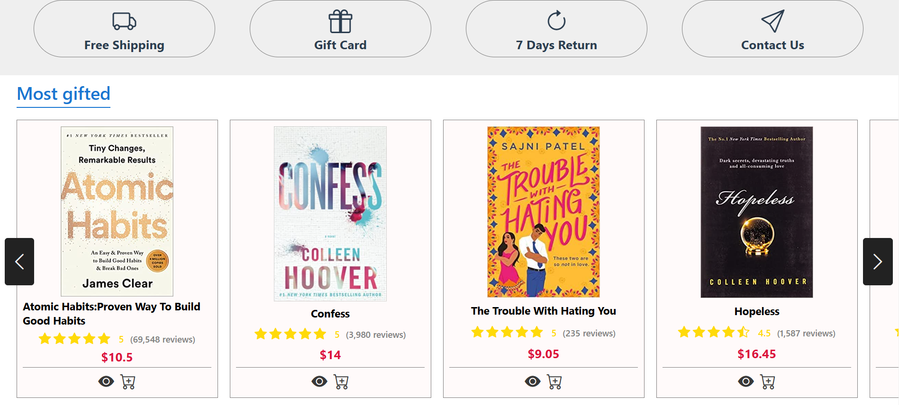
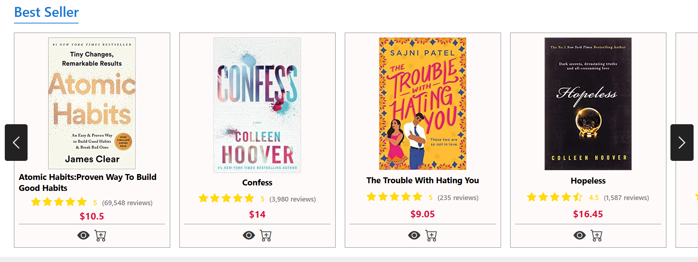
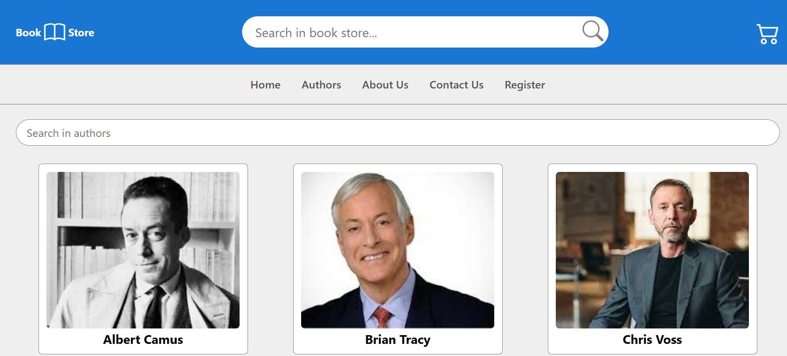
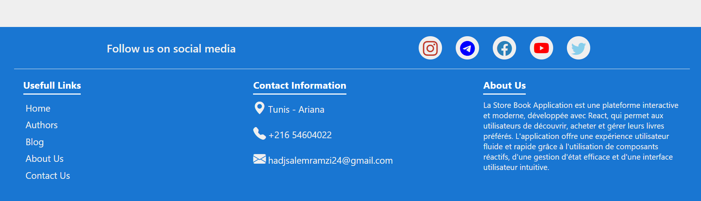

# BookStore avec React

**BookStore** est une application web moderne développée avec React qui permet aux utilisateurs de naviguer, rechercher, et acheter des livres en ligne. Ce projet utilise les technologies les plus récentes de React pour fournir une expérience utilisateur fluide et interactive. Il a été conçu pour être facile à utiliser et hautement réactif, tout en offrant un ensemble de fonctionnalités essentielles pour une librairie en ligne.

## Fonctionnalités principales :

- **Affichage des livres** : L'application affiche une liste de livres avec des informations telles que le titre, l'auteur, la description, et le prix.
- **Recherche de livres** : Les utilisateurs peuvent rechercher des livres en utilisant différents filtres comme le titre, l'auteur, ou la catégorie.
- **Page détaillée du livre** : Pour chaque livre, une page détaillée fournit des informations complètes, y compris des critiques des utilisateurs et la possibilité d'ajouter le livre au panier.
- **Panier d'achat** : Les utilisateurs peuvent ajouter des livres à leur panier, voir le contenu de leur panier et procéder à l'achat.
- **Gestion des utilisateurs** : L'application permet aux utilisateurs de s'inscrire, de se connecter et de gérer leurs informations personnelles.
- **Système de commandes** : Une fois que l'utilisateur a validé son panier, un système de commande prend en charge le processus d'achat, depuis l'authentification jusqu'à la confirmation de la commande.

## Technologies utilisées :
- **React.js** : Le cœur de l'application, utilisé pour construire l'interface utilisateur dynamique.
- **React Router** : Pour la gestion de la navigation entre les différentes pages de l'application.
- **State Management (useState, useContext)** : Pour gérer l'état de l'application, notamment le panier et l'authentification de l'utilisateur.
- **API RESTful** : Pour communiquer avec le backend, récupérer des informations sur les livres, les utilisateurs, et les commandes.
- **CSS (ou Styled-components)** : Pour le stylisme et l'interface utilisateur responsive.

## Objectifs du projet :
- Apprendre à utiliser React et ses fonctionnalités modernes.
- Créer une application web interactive pour une librairie en ligne.
- Intégrer une gestion de l'état avec React et un système de navigation efficace.
- Développer une expérience utilisateur fluide avec un design épuré et facile à utiliser.

## Détails supplémentaires :
Ce projet permet à l'utilisateur de découvrir une bibliothèque complète de livres, avec la possibilité de les acheter directement en ligne. Chaque livre est accompagné d'informations détaillées et les utilisateurs peuvent ajouter des livres à leur panier, effectuer un paiement et suivre leurs commandes. L'application est responsive et s'adapte à différents appareils (mobile, tablette, bureau).

---

## Available Scripts

In the project directory, you can run:

### `npm start`

Runs the app in the development mode.  
Open [http://localhost:3000](http://localhost:3000) to view it in your browser.

The page will reload when you make changes.  
You may also see any lint errors in the console.

### `npm run build`

Builds the app for production to the `build` folder.  
It correctly bundles React in production mode and optimizes the build for the best performance.

The build is minified and the filenames include the hashes.  
Your app is ready to be deployed!

### `npm run eject`

**Note: this is a one-way operation. Once you `eject`, you can't go back!**

If you aren't satisfied with the build tool and configuration choices, you can `eject` at any time. This command will remove the single build dependency from your project.

Instead, it will copy all the configuration files and the transitive dependencies (webpack, Babel, ESLint, etc.) right into your project so you have full control over them. All of the commands except `eject` will still work, but they will point to the copied scripts so you can tweak them. At this point you're on your own.

You don't have to ever use `eject`. The curated feature set is suitable for small and middle deployments, and you shouldn't feel obligated to use this feature. However, we understand that this tool wouldn't be useful if you couldn't customize it when you are ready for it.

### `USER INTERFACE`

